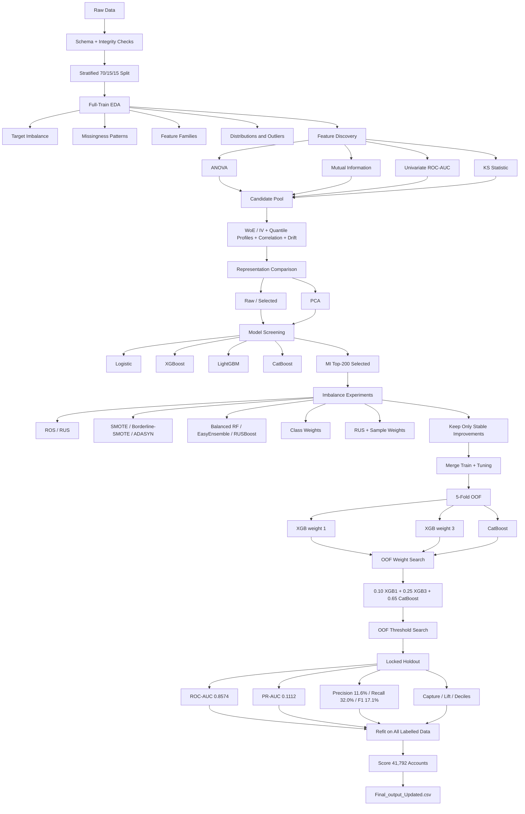

# Project Flow — Credit Card Behavioural Risk Scoring

This file gives a compact view of the modelling pipeline used in the final notebook.



## Final Decision Logic

```text
PCA
└─ tested → weaker than supervised/raw paths → REJECTED

MI top-200
└─ strong nonlinear boosted-model path → KEPT

Aggressive resampling
└─ often reduced PR-AUC / precision → REJECTED

Moderate class weighting
└─ improved minority sensitivity without destroying ranking → KEPT

RUS + sample weights
├─ promising single tuning split
└─ weaker 5-fold OOF performance → REJECTED

Final model
└─ OOF-selected weighted ensemble
   ├─ 10% XGBoost, weight 1
   ├─ 25% XGBoost, weight 3
   └─ 65% CatBoost
```
