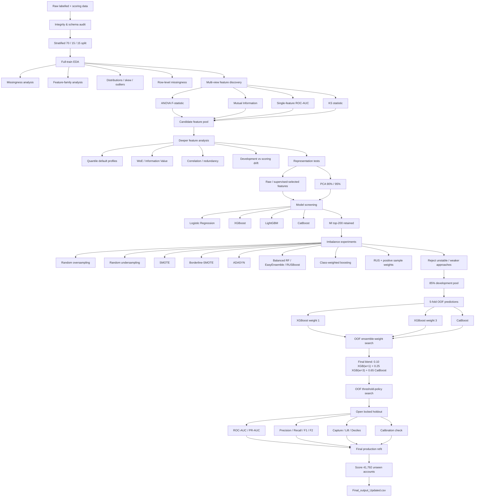

# Credit Card Behavioural Risk Scoring & Default Prediction for IDFC Bank

**Developing a Risk Management Framework for Credit Card Defaults**

---

## Overview

This project builds an end-to-end credit-risk modelling pipeline to estimate the probability that a credit-card customer defaults using anonymized behavioural, transaction, bureau and on-us attributes.

The project is intentionally structured as an **experiment log rather than a pre-decided modelling recipe**. Feature-selection methods, dimensionality reduction, imbalance treatments, class weighting, ensemble weights, calibration and threshold policies are tested empirically before the final model is locked.

The final system is a **5-fold OOF-selected weighted ensemble** built on the **top 200 Mutual Information features**.

### Final holdout performance

| Metric | Result |
|---|---:|
| ROC-AUC | **0.8574** |
| PR-AUC | **0.1112** |
| Precision | **11.6%** |
| Recall | **32.0%** |
| F1 | **17.1%** |
| Max-F2 Recall | **48.1%** |
| Max-F2 | **26.1%** |

> The precision/recall/F1 figures above correspond to the OOF-selected precision-constrained operating point. The final scoring file contains probabilities, not hard class labels.

---

## Problem Statement

The labelled development data is highly imbalanced: only about **1.42%** of accounts are defaults.

A naive model predicting every account as non-default would therefore achieve roughly **98.6% accuracy**, making accuracy a misleading optimization metric.

The modelling objective is instead to:

- rank genuinely risky accounts near the top;
- maintain useful precision-recall trade-offs;
- maximize default capture at realistic portfolio review capacities;
- avoid leakage and overly optimistic validation;
- test imbalance-learning methods empirically rather than assuming that stronger balancing must help.

---

## Repository Structure

```text
convolve-credit-card-behaviour-score/
│
├── README.md
├── PROJECT_FLOW.md
│
├── notebooks/
│   └── Convolve_3_0_final_nb.ipynb
│
├── report/
│   └── Convolve_3.0_report.pdf
│
├── output/
│   └── Final_output.csv
│
└── data/
    ├── Dev_data_to_be_shared.csv
    └── validation_data_to_be_shared.csv

---

## Data

### Labelled development data

- **96,806 accounts**
- **1,214 predictors**
- Target: `bad_flag`
- Identifier: `account_number`
- Defaults: **1,372**
- Default prevalence: **~1.417%**

### Unlabelled scoring data

- **41,792 accounts**
- Same predictor space
- No target column

### Feature families

The anonymized columns naturally fall into four families:

- Transaction
- Bureau
- Bureau enquiry
- On-us

Because the variables are anonymized, the project avoids inventing unsupported financial interpretations and instead analyses their statistical behaviour.

---

## Experimental Design

The initial labelled dataset is split using stratification:

```text
70% Train
   ├─ EDA
   ├─ feature discovery
   └─ early model fitting

15% Tuning
   ├─ feature-path comparison
   ├─ imbalance experiments
   └─ model screening

15% Locked Holdout
   └─ final evaluation only
```

After broad model choices are narrowed down, Train + Tuning are merged into an **85% development pool**.

The final model is then selected from **5-fold stratified out-of-fold predictions**, while the 15% holdout remains untouched until the modelling decisions are locked.

---

## End-to-End Project Flow



---

## Exploratory Data Analysis

### 1. Extreme class imbalance

Only about **1.42%** of labelled accounts default.

This immediately changes the evaluation strategy:

- accuracy is not used as the primary metric;
- PR-AUC is reported alongside ROC-AUC;
- precision, recall and F-scores are evaluated at explicit operating thresholds;
- capture and lift are used to measure portfolio-level ranking value.

### 2. Missingness

Missing values are not treated only as a cleaning problem.

The project compares missingness separately for default and non-default customers and finds that some variables have large missingness gaps between the two classes.

This suggests that **whether a value is missing can itself contain predictive information**.

### 3. Feature-family behaviour

Transaction variables dominate the dimensionality but are generally sparser and weaker as standalone predictors.

On-us and bureau-enquiry features contain stronger average univariate signal, although transaction variables can still contribute through interactions.

### 4. Distributional analysis

Strong predictors are inspected for:

- skewness;
- kurtosis;
- heavy tails;
- zero inflation;
- outliers;
- nonlinear default-rate profiles.

These observations motivate nonlinear tree-based models rather than relying only on linear classifiers.

---

## Feature Selection

Four complementary ranking methods are used so that no single statistical assumption dominates the feature-selection stage.

### ANOVA F-statistic

Measures mean separation between default and non-default classes.

### Mutual Information

Measures statistical dependence with the target and can capture nonlinear relationships.

### Single-feature ROC-AUC

Measures how well one feature alone ranks defaults relative to non-defaults.

### KS statistic

Measures the maximum separation between the class-conditional cumulative distributions.

The ranking methods do not fully agree, which is useful information rather than a problem.

### Why MI top-200?

The final representation uses the **top 200 Mutual Information features** because this path consistently performs strongly with nonlinear boosted-tree models and is retained for the final OOF stage.

---

## PCA Experiment

PCA is explicitly tested rather than automatically accepted or rejected.

For boosted models, PCA underperforms the raw/supervised-selected feature paths.

Examples from the executed comparisons:

| Model / Feature Path | ROC-AUC | PR-AUC |
|---|---:|---:|
| XGBoost + PCA 90% | 0.7852 | 0.0690 |
| LightGBM + PCA 90% | 0.7860 | 0.0610 |
| CatBoost + MI-200 | **0.8215** | **0.0979** |

PCA is therefore rejected for the final boosted-tree pipeline.

The interpretation is not that PCA is universally poor; rather, in this dataset, maximizing predictor variance does not preserve default-predictive signal as well as supervised feature selection.

---

## Model Screening

The project compares:

- Logistic Regression
- XGBoost
- LightGBM
- CatBoost

across multiple feature representations.

Tree boosting clearly outperforms the linear baseline, which is consistent with the nonlinear and highly skewed structure observed during EDA.

CatBoost + MI-200 is one of the strongest early single-model paths.

---

## Imbalance-Learning Experiments

A major part of the project investigates whether the poor minority-class performance is primarily caused by the ~69.6:1 class imbalance.

The following approaches are tested:

- no balancing;
- random oversampling;
- random undersampling;
- SMOTE;
- Borderline-SMOTE;
- ADASYN;
- Balanced Random Forest;
- EasyEnsemble;
- RUSBoost;
- class-weighted / cost-sensitive boosting;
- random undersampling + positive sample weights.

### Main finding

**Aggressive balancing does not reliably improve ranking quality.**

Mild SMOTE helps some early runs, but stronger synthetic balancing, aggressive class weights and balanced ensemble methods often reduce PR-AUC or precision.

This suggests that the difficulty is not only minority-class quantity; class overlap and the high-dimensional sparse feature space also matter.

---

## Undersampling + Sample-Weight Experiment

The latest notebook additionally tests a hybrid strategy:

```text
Random Undersampling
        +
Positive-row Sample Weights
```

The experiment keeps MI-200 fixed and tests RUS minority ratios of:

- 3%
- 5%
- 10%
- 20%

combined with positive weights:

- 1.5
- 2
- 3
- 5

The strongest single tuning-split candidate is:

**RUS 5% + positive sample weight 5**

It appears promising on the tuning split, but the model is then subjected to the same 5-fold OOF confirmation used for the final modelling decisions.

| Candidate | OOF PR-AUC | OOF ROC-AUC | Max F1 | Recall @ Max F1 |
|---|---:|---:|---:|---:|
| RUS 5% + sample weight 5 | 0.0786 | 0.8195 | 0.1372 | 15.0% |
| Selected 3-model ensemble | **0.0815** | **0.8255** | **0.1479** | **22.7%** |

The apparent tuning gain does **not** survive OOF validation, so the hybrid approach is rejected for final use.

---

## Final OOF Ensemble

After broad experimentation, Train + Tuning are merged into the 85% development pool.

Three complementary base models generate 5-fold OOF predictions:

1. XGBoost with `scale_pos_weight = 1`
2. XGBoost with `scale_pos_weight = 3`
3. CatBoost

The ensemble weights are **not manually chosen in advance**.

They are selected after the OOF predictions are available.

### Selected weights

\[
P(\text{default}) =
0.10P_{XGB,w=1}
+
0.25P_{XGB,w=3}
+
0.65P_{CatBoost}
\]

So the final solution is an **ensemble model**, not CatBoost alone.

---

## Threshold Policies

The model produces a continuous default-risk score.

Three operating policies are analysed:

### Max-F1

Balances precision and recall equally.

### Max-F2

Weights recall more strongly than precision.

### Precision-constrained recall

Requires precision to remain at or above a chosen minimum and then maximizes recall.

The main illustrative policy requires approximately **10% minimum precision**.

Importantly, these thresholds are selected from OOF predictions rather than by repeatedly optimizing against the final holdout.

---

## Final Holdout Results

### Ranking performance

| Metric | Result |
|---|---:|
| ROC-AUC | **0.8574** |
| PR-AUC | **0.1112** |

For context, the random PR baseline is approximately equal to the default prevalence:

\[
PR_{random} \approx 0.0142
\]

### Precision-constrained operating point

| Metric | Result |
|---|---:|
| Precision | **11.6%** |
| Recall | **32.0%** |
| F1 | **17.1%** |

### Recall-oriented Max-F2 point

| Metric | Result |
|---|---:|
| Precision | **9.25%** |
| Recall | **48.1%** |
| F2 | **26.1%** |

---

## Portfolio Capture and Lift

The model is particularly useful as a **risk-ranking system**.

| Highest-risk portfolio reviewed | Defaults captured | Lift |
|---:|---:|---:|
| Top 1% | ~13.6% | ~13.6x |
| Top 5% | ~39.8% | ~8.0x |
| Top 10% | ~53.4% | ~5.3x |
| Top 20% | ~76.2% | ~3.8x |

This means that reviewing only the highest-risk **5%** of accounts identifies roughly **40% of all defaults** in the holdout population.

---

## Calibration

Raw ensemble scores are compared with:

- isotonic calibration;
- Platt scaling.

Neither calibration method provides a useful enough improvement to justify replacing the raw ensemble probabilities.

The raw ensemble is therefore retained.

---

## What Was Kept vs Rejected

| Experiment | Decision | Reason |
|---|---|---|
| PCA 90/95% | Rejected | Weaker ranking than supervised/raw paths |
| ANOVA | Benchmark | Strong statistical filter, but not final representation |
| Mutual Information top-200 | **Kept** | Strong boosted-model path and final OOF representation |
| Random oversampling | Rejected | Did not beat strongest boosting path |
| Random undersampling | Rejected | Discarded majority information without final PR gain |
| SMOTE | Rejected as final | Mild ratios sometimes helped; stronger ratios degraded ranking |
| Borderline-SMOTE | Rejected | Lower PR-AUC |
| ADASYN | Rejected | Did not improve final ranking |
| Balanced Random Forest | Rejected | Lower PR-AUC |
| EasyEnsemble | Rejected | Weaker precision/ranking trade-off |
| RUSBoost | Rejected | High recall but very weak precision/ranking |
| RUS + sample weights | Rejected | Tuning gain did not survive 5-fold OOF |
| XGBoost weight 1 | **Kept** | Strong ranking and diversity |
| XGBoost moderate weight | **Kept** | Improved minority sensitivity |
| CatBoost | **Kept** | Strong complementary OOF model |
| OOF ensemble search | **Kept** | Weights selected empirically |
| Isotonic / Platt calibration | Rejected | No useful holdout improvement |

---

## Final Output

The production models are refit on all labelled observations using MI top-200 features.

The final output file contains:

```text
account_number
default_probability
```

The scoring file contains **41,792 accounts**.

The model outputs probabilities rather than hard 0/1 labels so that downstream users can choose thresholds based on business cost, review capacity and risk appetite.

---

## How to Run

### 1. Clone the repository

```bash
git clone <your-repository-url>
cd convolve-credit-card-behaviour-score
```

### 2. Create an environment

```bash
python -m venv .venv
source .venv/bin/activate
```

Windows:

```bash
.venv\Scripts\activate
```

### 3. Install dependencies

Core packages used in the notebook include:

```bash
pip install pandas numpy scipy scikit-learn matplotlib xgboost lightgbm catboost imbalanced-learn joblib
```

### 4. Place the datasets

```text
data/
├── Dev_data_to_be_shared.csv
└── validation_data_to_be_shared.csv
```

The notebook also supports the Google Drive paths used during development.

### 5. Run the notebook

Open:

```text
notebooks/Convolve_3_0_final_nb.ipynb
```

and execute the cells in order.

---

## Key Takeaways

1. **Accuracy is inappropriate for this problem** because defaults represent only ~1.42% of the data.
2. **Missingness itself contains signal** for several variables.
3. **Feature-selection methods disagree**, so multiple statistical views are useful.
4. **MI top-200** works better than PCA for the final boosted-tree setup.
5. **Aggressive rebalancing is not automatically beneficial**.
6. Moderate cost sensitivity works better than extreme class weighting.
7. A promising tuning result should not be accepted without stronger validation.
8. **RUS + sample weighting looked promising on one split but failed the OOF check**.
9. OOF predictions provide a stronger basis for ensemble and threshold selection.
10. The final model is most compelling as a **risk-ranking system**, concentrating a large share of defaults in a small high-risk segment.

---

## Detailed Report

For equations, EDA figures, experiment tables, imbalance analysis, calibration results, threshold policies and full methodology, see:

```text
report/Convolve_3.0_report.pdf
```

---

## Authors

**Saket Mehla**  
**Sahaj Yadav**

